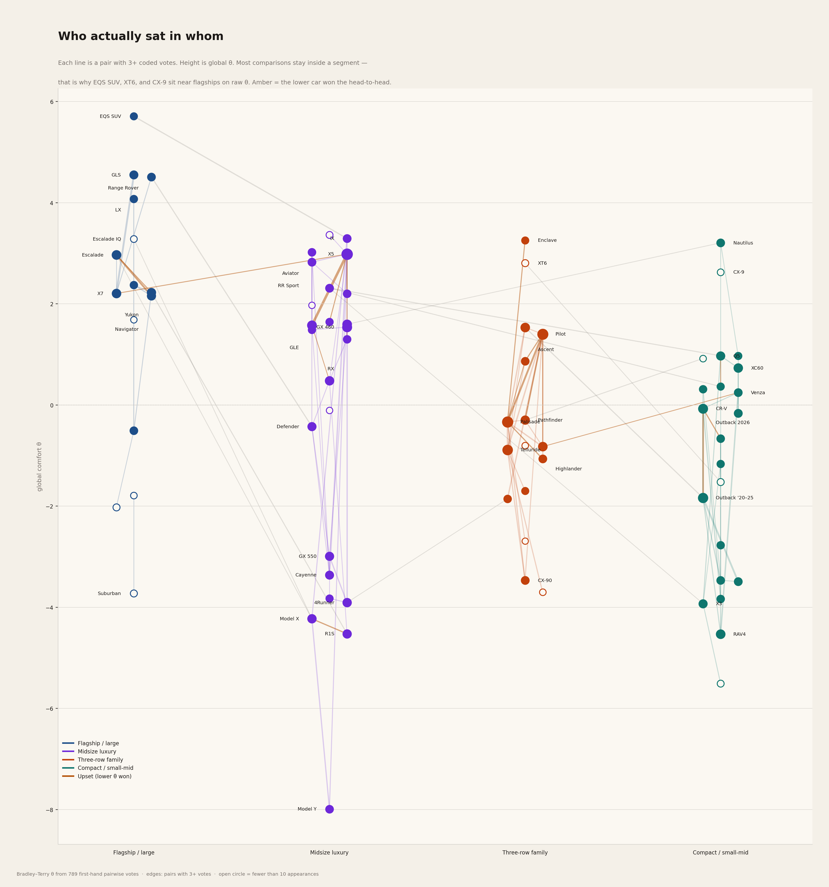

# SUV Comfort Ranking from Customer Comparisons

Research project that ranks SUV comfort from **customer comments that compare two or more SUVs and state a preference**. Isolated praise ("the X5 is comfy") is not used. Only relative statements are.

## What this is

A Bradley–Terry ranking of current-generation SUVs on ride comfort, seats, cabin quiet, and long-trip fatigue, built from first-hand owner and test-drive comments on Reddit, X, and Edmunds/Cars.com consumer reviews. Collected 18 August 2026; expanded the same day through nine research passes, then audited (19 unsupported rows removed; evidence tags, quotes, and `home_team` recoded). A second fit down-weights source bias. A third fit keeps only owners (no same-day testers). Upvotes are planned to be removed from all data and calculations — the `upvotes` column and the karma boost in the default fit are legacy.

## How to read it

Open `reports/composite_ranking.md` first. That file is the result: one composite chain plus segment rankings. `reports/bias_analysis.md` is the second reading — same quotes, less Reddit karma and brand-sub weight. `reports/owner_analysis.md` is the third — same quotes, **no test drivers**.

- `data/comparisons.csv` — coded pairwise votes (each row has a stable 4-character `id`)
- `src/rank.py` — Bradley–Terry fit (default + bias-adjusted + owners)
- `data/ranking.csv` / `data/ranking_bias.csv` / `data/ranking_owners.csv` — machine-readable tables
- `reports/figures/` — PNGs of the graph, segment ladders, rank robustness, and top matchups
- `audit/` — verification kit (`fetch_pages.sh`, `parse_reddit.py`, `audit_rows.py`), `compiled.md` (applied full-file audit), and `old/` (per-batch working notes)
- `reports/methodology.md` — inclusion rules, weighting, generation coding, limits, and how to read Edmunds/Cars.com when the live review page is blocked

```bash
python3 src/rank.py
```

Then rebuild the figures from those CSVs (does not re-fit):

```bash
# matplotlib + numpy
python3 src/plot.py

# this machine (Nix):
nix-shell -p python3Packages.matplotlib python3Packages.numpy --run "python3 src/plot.py"
```

Writes `reports/figures/comfort_ladders.png`, `comparison_graph.png`, `rank_robustness.png`, and `top_matchups.png`.

## Who met whom

Each line is a pair with 3+ coded votes. Height is global θ; columns are shopping segments. Most comparisons stay inside a column — that is why EQS SUV / XT6 / CX-9 sit near flagships on raw θ. Amber = the lower car won the head-to-head. Full-size image and the other charts: [`reports/figures/`](reports/figures/).



## Composite chain

Shopping order from who actually beat whom. Later bands are generally less comfortable. `≈` is a split; `/` is “about this neighborhood.” Caveats and who-met-whom: [`reports/composite_ranking.md`](reports/composite_ranking.md).

| | Band | Models |
|---:|---|---|
| 1 | Magic carpet | **Range Rover** ≈ **GLS** ≈ **LX** |
| 2 | Flagship / comfort-first luxury | Range Rover Sport ≈ Escalade / Escalade IQ / Navigator / Grand Wagoneer / Yukon / X7 / BMW iX / Lincoln Aviator / EQS SUV |
| 3 | Dual-purpose luxury | Mercedes GLE / Audi Q7 / Acura MDX / Genesis GV80 / **BMW X5** ≈ **Lexus RX** / Audi Q8 |
| 4 | Compact luxury | Audi Q5 / Lincoln Nautilus / Mercedes GLC / Volvo XC60 / Genesis GV70 / Lincoln Corsair |
| 5 | Comfortable three-row / near-luxury compact | **Palisade** ≥ Ascent (ride) ≥ Pathfinder (seats vs Pilot) ≥ Telluride ≥ Atlas ≥ Expedition (split) ≥ 2026 Outback / Murano / Venza / Santa Fe |
| 6 | Mainstream three-row | Honda Pilot / Toyota Highlander / Toyota Grand Highlander / Mazda CX-90 |
| 7 | Comfortable compact | Honda CR-V ≈ 2020–25 Subaru Outback |
| 8 | Firm / fatiguing | RAV4 / CX-5 / CX-50 / BMW X3 / Crosstrek / Model Y / 4Runner / Forester / R1S / BMW X1 |

Off the ladder: **GX 460** beats 4Runner and splits RX (not an X5). **GX 550** beats Land Cruiser / usually 4Runner; loses to the 460 and air Defender. **Sequoia** loses ride/NVH to LX / Yukon / Range Rover / Navigator. **Defender** loses to Range Rover; beats Cayenne / R1S / GX 550. **Escalade IQ** is 6–1 vs Model X and gas Escalade — not a Range Rover.

## Mechanical ranking

Core models with **three or more** coded appearances. Bradley–Terry θ and win–loss from the default fit (`python3 src/rank.py`). Raw θ still inflates cars that only beat same-class rivals (EQS SUV 9–1 vs iX/R1S, Escalade IQ 6–1 vs Model X, XT6 7–2, CX-9 7–0 vs Highlander/Pilot/RAV4). Use the chain above, not this numeric list, as a shopping order.

| Rank | Model | θ | W–L |
|---:|---|---:|---:|
| 1 | Mercedes EQS SUV | 5.71 | 9–1 |
| 2 | Mercedes GLS | 4.55 | 17–4 |
| 3 | Range Rover | 4.51 | 15–2 |
| 4 | Lexus LX | 4.08 | 10–2 |
| 5 | Audi Q8 | 3.37 | 5–3 |
| 6 | BMW iX | 3.29 | 11–7 |
| 7 | Cadillac Escalade IQ | 3.28 | 6–1 |
| 8 | Buick Enclave | 3.26 | 7–3 |
| 9 | Lincoln Nautilus | 3.21 | 14–3 |
| 10 | Range Rover Sport | 3.02 | 12–3 |
| 11 | BMW X5 | 2.98 | 35–50 |
| 12 | Cadillac Escalade | 2.97 | 18–15 |
| 13 | Lincoln Aviator | 2.83 | 14–4 |
| 14 | Cadillac XT6 | 2.81 | 7–2 |
| 15 | Mazda CX-9 | 2.63 | 7–0 |
| 16 | Jeep Grand Wagoneer | 2.37 | 7–6 |
| 17 | Genesis GV70 | 2.31 | 14–4 |
| 18 | GMC Yukon | 2.23 | 21–5 |
| 19 | BMW X7 | 2.21 | 10–20 |
| 20 | Genesis GV80 | 2.20 | 8–7 |
| 21 | Lincoln Navigator | 2.16 | 13–11 |
| 22 | Jeep Grand Cherokee | 1.97 | 3–2 |
| 23 | Infiniti QX80 | 1.69 | 4–1 |
| 24 | Acura MDX | 1.64 | 8–4 |
| 25 | Lexus RX | 1.60 | 19–14 |
| 26 | Mercedes GLE | 1.58 | 21–14 |
| 27 | Lexus GX | 1.54 | 25–14 |
| 28 | Subaru Ascent | 1.54 | 22–9 |
| 29 | Lexus TX | 1.49 | 6–6 |
| 30 | Honda Pilot | 1.40 | 33–37 |
| 31 | Audi Q7 | 1.30 | 9–5 |
| 32 | Audi Q5 | 0.97 | 15–9 |
| 33 | Lincoln Corsair | 0.97 | 6–5 |
| 34 | Nissan Murano | 0.92 | 4–2 |
| 35 | Volkswagen Atlas | 0.87 | 11–5 |
| 36 | Volvo XC60 | 0.73 | 17–12 |
| 37 | Volvo XC90 | 0.48 | 15–13 |
| 38 | Porsche Macan | 0.37 | 5–6 |
| 39 | Subaru Outback 2026 | 0.31 | 12–1 |
| 40 | Toyota Venza | 0.25 | 14–3 |
| 41 | Honda CR-V | −0.07 | 21–18 |
| 42 | Mercedes GLE AMG | −0.11 | 1–4 |
| 43 | Lexus NX | −0.16 | 8–11 |
| 44 | Nissan Pathfinder | −0.30 | 15–11 |
| 45 | Hyundai Palisade | −0.33 | 54–22 |
| 46 | Land Rover Defender | −0.43 | 10–13 |
| 47 | Toyota Sequoia | −0.50 | 3–13 |
| 48 | Volkswagen Tiguan | −0.66 | 11–4 |
| 49 | Jeep Grand Cherokee L | −0.80 | 2–4 |
| 50 | Toyota Highlander | −0.82 | 8–23 |
| 51 | Kia Telluride | −0.89 | 28–26 |
| 52 | Toyota Grand Highlander | −1.06 | 5–12 |
| 53 | Mercedes GLC | −1.17 | 6–6 |
| 54 | Cadillac XT5 | −1.52 | 1–8 |
| 55 | Ford Explorer | −1.70 | 4–6 |
| 56 | Ford Expedition | −1.79 | 3–3 |
| 57 | Subaru Outback (2020–25) | −1.84 | 31–16 |
| 58 | Honda Passport | −1.86 | 6–8 |
| 59 | Chevrolet Tahoe | −2.02 | 2–7 |
| 60 | Hyundai Santa Fe | −2.69 | 0–4 |
| 61 | Mazda CX-5 | −2.77 | 5–8 |
| 62 | Lexus GX 550 | −2.99 | 9–15 |
| 63 | Porsche Cayenne | −3.36 | 4–17 |
| 64 | Subaru Forester | −3.47 | 2–14 |
| 65 | Mazda CX-90 | −3.47 | 3–15 |
| 66 | Subaru Crosstrek | −3.49 | 4–14 |
| 67 | Kia Sorento | −3.70 | 0–6 |
| 68 | Chevrolet Suburban | −3.72 | 1–8 |
| 69 | Toyota Land Cruiser | −3.82 | 4–7 |
| 70 | Mazda CX-50 | −3.83 | 1–13 |
| 71 | Toyota 4Runner | −3.91 | 3–24 |
| 72 | BMW X3 | −3.93 | 3–20 |
| 73 | Tesla Model X | −4.23 | 11–16 |
| 74 | Rivian R1S | −4.52 | 5–21 |
| 75 | Toyota RAV4 | −4.53 | 1–31 |
| 76 | BMW X1 | −5.51 | 1–7 |
| 77 | Tesla Model Y | −7.99 | 0–16 |
