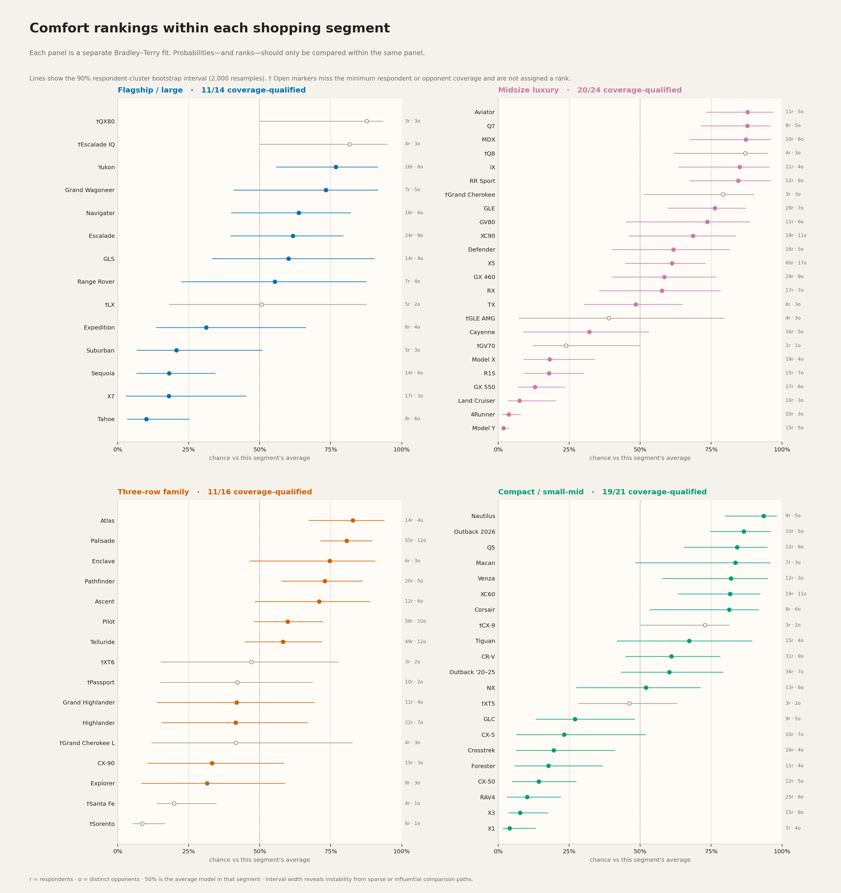
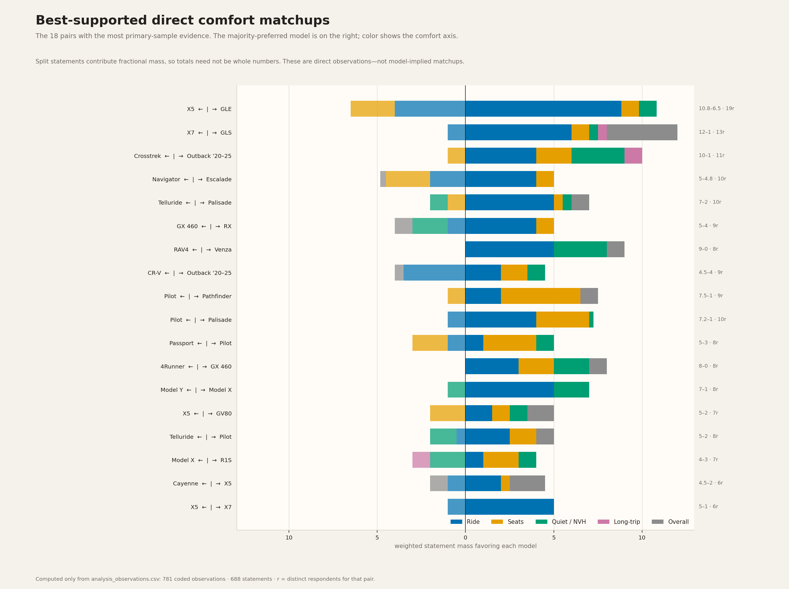
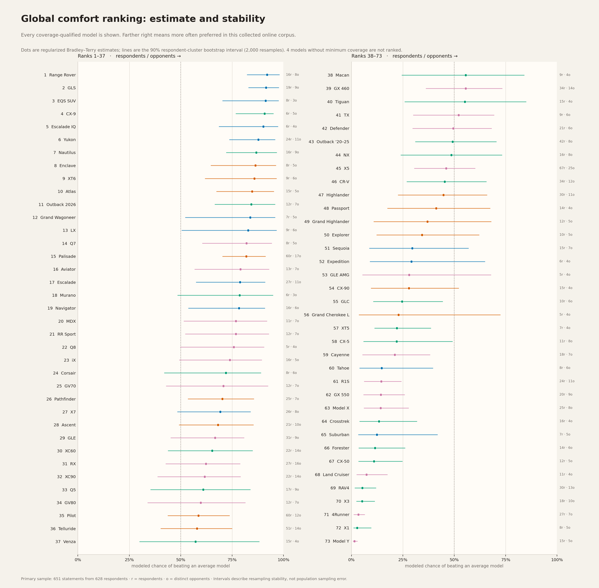

# SUV Comfort Ranking from Customer Comparisons

This repository ranks SUV comfort from first-hand online comments that name two or more vehicles and pick a winner on ride, seats, cabin quietness, long-trip fatigue, or overall comfort, by coding those pairwise judgments and fitting a regularized Bradley–Terry model.

## Rankings within shopping segments

Each panel is a separate fit using only comparisons inside that segment. Scores and ranks must not be compared across panels. Open `†` entries lack five respondents or three opponents and do not receive an ordinal rank.



| Segment | Point-estimate leaders | Main caution |
|---|---|---|
| Flagship / large | QX80, Yukon, Grand Wagoneer, Navigator, Escalade, Range Rover | Only 76 within-segment statements; QX80's lead rests on a thin LX sample. |
| Midsize luxury | Q7, Aviator, MDX, Range Rover Sport, iX, GLE, XC90 | Comfort remains multidimensional; Defender–XC90 and several Palisade residuals are large. |
| Three-row family | Atlas, Palisade, Enclave, Pathfinder, Ascent, Pilot, Telluride | Palisade has far more support than the other point leaders. |
| Compact / small-mid | Nautilus, 2026 Outback, Q5, Macan, Venza, XC60, Corsair | CX-9 lacks enough within-segment coverage despite its global point rank. |

The [full segment tables](reports/rankings.md#within-segment-rankings) include probability, rank ranges, support, and withheld models.

## What people compared directly

The chart below uses only the filtered primary observations—never model-implied wins. Each statement has total mass one, split across its coded judgments, so totals can be fractional.



Among the best-supported pairs, GLS is 12–1 in normalized statement mass against X7, Venza is 9–0 against RAV4, GX 460 is 8–0 against 4Runner, and Palisade is 7.2–1 against Pilot. The axis breakdown matters—Escalade versus Navigator, for example, splits ride from seats.

## Global ranking

Dots are regularized Bradley–Terry point estimates. Lines are 90% respondent-cluster resampling intervals. The right annotation is `respondents · opponents`; three models below the minimum coverage rule are not assigned a rank.



The first ten point ranks show why the interval belongs next to the number. Infiniti QX80 now sits at the top after two ClubLexus first-hand comparisons with LX crossed the coverage threshold, but its 90% rank range still runs to 20. Range Rover and GLS remain near the top with wider samples. CX-9 is still a warning against reading point rank as a podium: six respondent clusters compared it with five mostly mainstream opponents, and its stability range is 2–24.

| Rank | Model | Modeled P vs average | 90% rank range | Respondents | Opponents |
|---:|---|---:|---:|---:|---:|
| 1 | Infiniti QX80 | 94% | 1–20 | 6 | 5 |
| 2 | Range Rover | 91% | 1–19 | 16 | 8 |
| 3 | Mazda CX-9 | 91% | 2–24 | 6 | 5 |
| 4 | Mercedes EQS SUV | 90% | 1–26 | 8 | 3 |
| 5 | Cadillac Escalade IQ | 90% | 1–28 | 6 | 4 |
| 6 | Mercedes GLS | 89% | 1–20 | 21 | 9 |
| 7 | Lincoln Nautilus | 88% | 1–23 | 16 | 9 |
| 8 | GMC Yukon | 87% | 2–25 | 24 | 11 |
| 9 | Buick Enclave | 86% | 2–32 | 8 | 5 |
| 10 | Cadillac XT6 | 86% | 2–34 | 9 | 6 |

`P vs average` is the model's estimate of how often this vehicle would be preferred to an average vehicle **in this corpus**. See the [complete generated global table](reports/rankings.md#global-ranking), including the three models whose coverage was withheld.

## What this can and cannot answer

The estimand is the ordering implied by the collected statements in which someone compared at least two SUVs from first-hand experience and chose a comfort winner. It is not a representative survey of SUV owners. Statements with no preference or a tie were not collected, so every estimate is conditional on an expressed preference. Stability intervals describe this corpus under respondent resampling, not uncertainty for all owners.

| Primary analysis | Count |
|---|---:|
| Coded source rows | 840 |
| Retained pair-axis judgments | 781 |
| Source statements | 688 |
| Respondent clusters | 665 |
| Models in the connected global graph | 77 |
| Respondent bootstrap refits | 2,000 |

Reddit supplies 668 of the 781 retained observations; Edmunds, Cars.com, owner forums (MBWorld, ClubLexus, Genesis Owners, Rivian Forums), BITOG, and X supply the rest. Ride is the most common axis (370), then seats (150), NVH (144), overall (99), and explicit long-trip fatigue (18).

## How the analysis works

1. Keep first-hand owner, family-car, rental/loaner, passenger, and test-drive comparisons; exclude thin opinion, journalist, non-SUV, and unsupported-axis rows.
2. Match rows back to source statements and privacy-preserving respondent clusters. A multi-car comment receives total mass one rather than counting like several independent people.
3. Fit regularized global and within-segment Bradley–Terry models with a weak `Normal(0, 2.5²)` score prior and a converged SciPy optimizer.
4. Resample respondents 2,000 times for the displayed 90% stability intervals, and resample threads 1,000 times as a discussion-clustering sensitivity check.
5. Withhold ordinal rank unless a model has five respondent clusters, three opponents, and membership in the scope's main connected component.

The primary fit gives statements equal influence. Former evidence-quality and home-team multipliers are retained only as a `legacy_weights` sensitivity scenario; they are not described as a bias correction.

[Source sensitivity](reports/figures/sensitivity.png) compares probabilities under the primary, owners-only, and neutral-forum samples. The machine-readable sensitivity results also include a run excluding `home_team=1` observations (same-team wins). The [coverage graph](reports/figures/coverage_graph.png) shows which direct pairings hold the global scale together.

Read the [methodology](reports/methodology.md), [model diagnostics](reports/model_diagnostics.md), and [machine-readable sensitivity table](data/ranking_sensitivity.csv) for the full specification.

## Reproduce it

```bash
# numpy + scipy; writes rankings, intervals, diagnostics, and generated reports
python3 src/rank.py

# matplotlib + numpy; reads only the generated analysis outputs
python3 src/plot.py

# fast statistical tests
pytest -q
```

On Nix:

```bash
nix-shell -p python3Packages.numpy python3Packages.scipy --run "python3 src/rank.py"
nix-shell -p python3Packages.matplotlib python3Packages.numpy --run "python3 src/plot.py"
```

Useful options:

```bash
python3 src/rank.py --bootstrap-reps 2000 --seed 20260819
python3 src/rank.py --check
python3 src/plot.py --only segment_rankings direct_matchups
```

## Repository map

- [`data/comparisons.csv`](data/comparisons.csv) — audited coded rows with statement/respondent/thread/batch metadata
- [`data/analysis_observations.csv`](data/analysis_observations.csv) — generated primary observations and normalized analysis weights
- [`data/ranking.csv`](data/ranking.csv) / [`data/ranking_segments.csv`](data/ranking_segments.csv) — global and within-segment results
- [`src/rank.py`](src/rank.py) / [`src/plot.py`](src/plot.py) — analysis and visualization pipeline
- [`audit/`](audit/) — source snapshots, verification, and metadata backfill tools
- [`reports/collection_history.md`](reports/collection_history.md) — archived nine-pass narrative and retired hand-authored chain

## Limits worth keeping in view

- This was purposive collection, expanded around thin models; sampling probabilities are unknown.
- Reddit supplies most observations, and brand communities shape what gets discussed.
- Statements without a winner are absent. The model estimates preferences conditional on someone expressing one.
- Wheel size, tires, air suspension, trim, generation, road, and body shape can flip a nameplate comparison.
- “Comfort” combines ride, seats, NVH, fatigue, and overall judgments; one latent score cannot capture every tradeoff.
- Stability intervals describe this corpus under respondent resampling, not uncertainty for all SUV owners.
